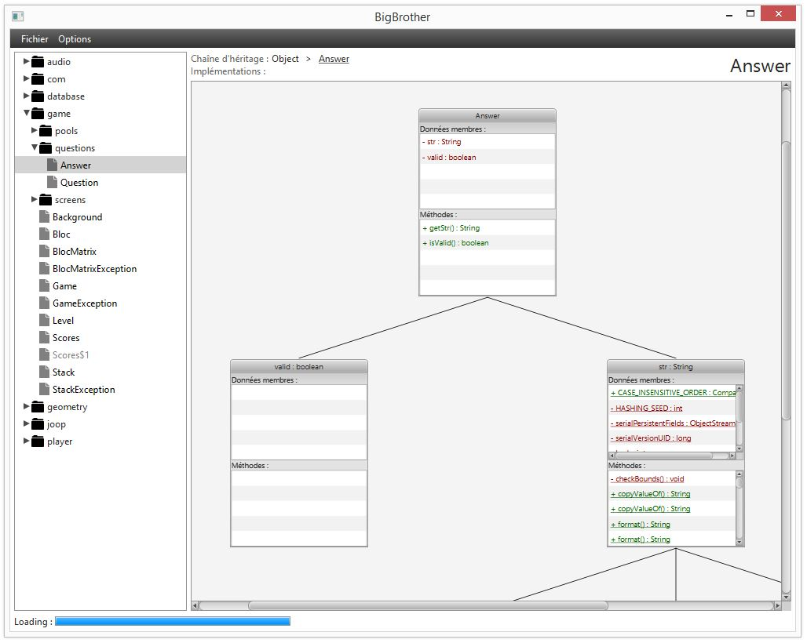

Java-BigBrother
==============

Java programs exploration.

BigBrother
----------

Core library with observables models and JAR files scanner.

BigBrother-Gui
--------------

JavaFX with FXML graphic user interface.

TreeChart
---------

Modified [Niklas Hoffmann's TreeChart](https://code.google.com/p/javafx-treechart/).